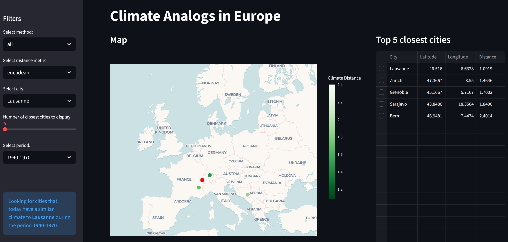
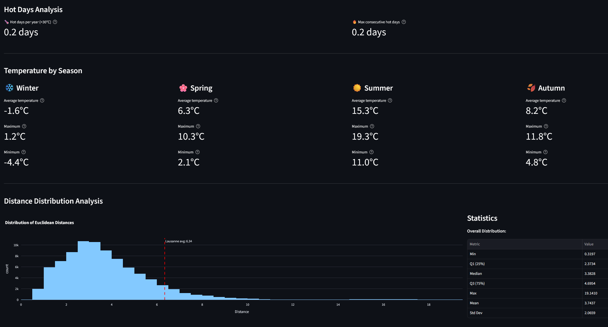

# MLBD Project - Climate Analogs

#### Authors: Eva Ray, Massimo Stefani, Abdellah Jahjah

This project identifies climate analogues for European cities in 1970 (backward) and 2050 (forward). Each city is represented by a multidimensional climate vector built from seasonal averages of temperature, precipitation, and wind speed. Similarity between cities is computed using metrics such as Mahalanobis and Euclidean distances. The results are displayed on an interactive map that lets users explore which cities share comparable past or future climates.

## Notebooks

- `extract_climate_features_historical.ipynb`: Notebook for extracting climate features from monthly historical data.
- `extract_temperature_features_historical.ipynb`: Notebook for extracting temperature features from hourly historical data.
- `extract_climate_features_future.ipynb`: Notebook for extracting climate features from future projections.
- `data_exploration.ipynb`: Notebook for exploring the extracted climate features.
- `pca.ipynb`: Notebook for performing Principal Component Analysis (PCA) on the extracted features.
- `climate_analogs.ipynb`: Notebook for identifying climate analogs based on the extracted features.
- `encoder.ipynb`: Notebook for training and evaluating an encoder model on the climate data.
- `result_analysis.ipynb`: Notebook to explore the results obtained for the climate analogs.

> Note: The 3 extraction notebooks depend on raw climate data that is not included in this repository due to size constraints.

## Launch Streamlit app

You need python 3.10 or higher installed on your machine.

1. Install the required packages:
   ```bash
   pip install -r requirements.txt
   ```
2. Launch the Streamlit app:
   ```bash
    streamlit run streamlit_app.py
    ```

At this point, a new tab should open in your default web browser displaying the interactive map of climate analogs. You can select the following parameters:
- **Analogue year**: 1970 (backward) or 2050 (forward)
- **Distance metric**: Mahalanobis or Euclidean
- **Scenario for future predictions**: ssp126, ssp370, ssp585
- **City**: Select a European city from the dropdown menu
- **Number of analog cities**: Choose how many analog cities to display (in descending order of similarity)

The map will update to show the selected city's location and its climate analogs based on the chosen parameters.



Some metrics about the city and its analogs are also displayed below the map:



